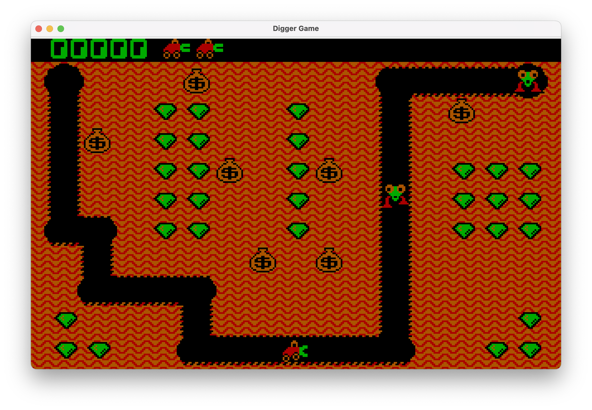

# Digger
[Classic Digger](https://en.wikipedia.org/wiki/Digger_(video_game)) old DOS game revisited in Java


## About the Game
Digger has been ported to many different platforms over the years, including the Commodore 64, Amiga

The game Digger was developed by Windmill Software in 1983. This small company, founded by Dan Goodman, released several other games, but Digger became their most well-known and successful project.

The game is a classic example of a digging game, where the player controls a character named Digger who must collect treasures hidden in a cave. The cave is filled with various obstacles, including rocks, dirt, and enemies, which must be avoided or destroyed. Digger can dig through dirt and rocks to reveal treasures.
The game features a simple yet addictive gameplay mechanic, with a variety of levels and increasing difficulty. The graphics and sound effects are basic by today's standards, but they were impressive for their time.

## About the port
This is a Java clone of the classic Digger game. The game was ported to Java from C code, utilizing the applet code from 1998. The work is still in progress, although I used the original graphics and sounds.
The code uses only standard JDK libraries. The graphics are implemented using AWT.

## digger.ini 
| Parameter      | Description                                      |
|----------------|--------------------------------------------------|
| `speed`        | The speed of the game, default set to 66.        |
| `scale_factor` | The scale factor for graphics, default set to 3. |

## Controls
| Control     | Action       |
|-------------|--------------|
| Up Arrow    | Move Up      |
| Down Arrow  | Move Down    |
| Left Arrow  | Move Left    |
| Right Arrow | Move Right   |
| Space       | Game pause   |
| F1          | Fire         |
| F10         | Start screen |

## Ho to run (under constraction)
To run the game, you need to have Java installed on your system. You can download the latest version of Java from the [official website](https://www.oracle.com/java/technologies/javase-jdk11-downloads.html).

1. Clone the repository:
   ```bash
   git clone https://github.com/mortihead/digger
   cd digger
   javac -d out/production/Digger src/org/digger/app/*.java
   java -cp out/production/Digger org.digger.app.Digger```
   