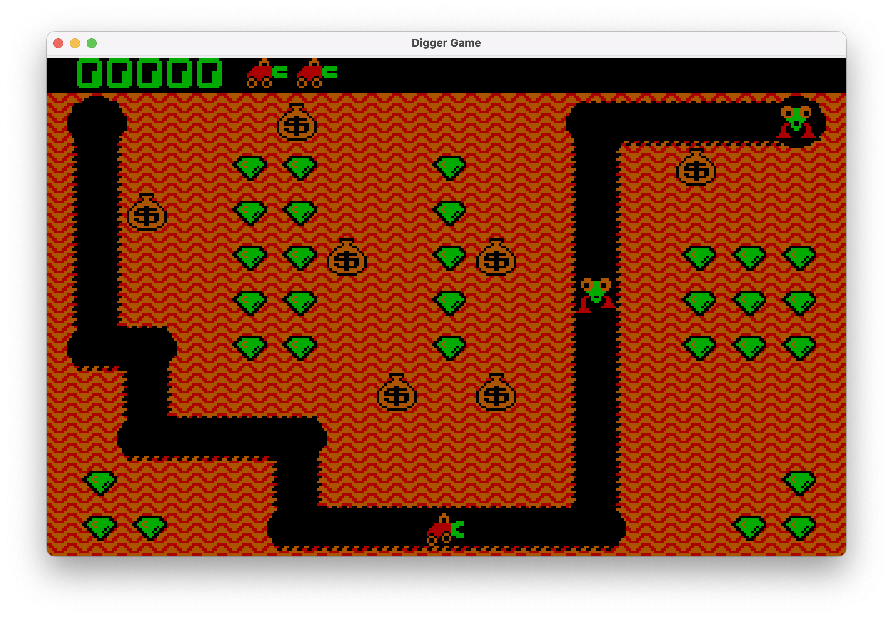

# Digger
[Classic Digger](https://en.wikipedia.org/wiki/Digger_(video_game)) old DOS game revisited in Java



## About the Game
Digger has been ported to many different platforms over the years, including the Commodore 64, Amiga

The game Digger was developed by Windmill Software in 1983. This small company, founded by Dan Goodman, released several other games, but Digger became their most well-known and successful project.

The game is a classic example of a digging game, where the player controls a character named Digger who must collect treasures hidden in a cave. The cave is filled with various obstacles, including rocks, dirt, and enemies, which must be avoided or destroyed. Digger can dig through dirt and rocks to reveal treasures.
The game features a simple yet addictive gameplay mechanic, with a variety of levels and increasing difficulty. The graphics and sound effects are basic by today's standards, but they were impressive for their time.

## About the port
This is a Java clone of the classic Digger game. The game was ported to Java from C code, utilizing the applet code from 1998. The work is still in progress, although I used the original graphics and sounds.
The code uses only standard JDK libraries. The graphics are implemented using AWT.

## digger.ini 
| Parameter      | Description                                      |
|----------------|--------------------------------------------------|
| `speed`        | The speed of the game, default set to 66.        |
| `scale_factor` | The scale factor for graphics, default set to 3. |

## Controls
| Key         | Action                                    |
|-------------|-------------------------------------------|
| ↑           | Move up                                   |
| ↓           | Move down                                 |
| ←           | Move left                                 |
| →           | Move right                                |
| Space       | Pause / unpause game                      |
| F1          | Fire (shoot)                              |
| Enter/Space | Start game (on title screen)              |
| Esc         | Switch between 1 and 2 players (title)    |
| F7          | Toggle background music on/off            |
| F9          | Toggle all sound on/off                   |
| F10         | Return to title screen                    |
| +           | Increase game speed                       |
| -           | Decrease game speed                       |
| Ctrl+T      | Take over during recorded game playback   |

## How to run
To run the game, you need to have Java 17+ installed on your system.

### Build and run with Maven
```bash
git clone https://github.com/mortihead/digger
cd digger

mvn compile
java -cp target/classes org.digger.app.Digger
```

### Build executable JAR with Maven
```bash
mvn package
java -jar target/digger-app-1.0.0.jar
```

### Build and run manually
```bash
git clone https://github.com/mortihead/digger
cd digger
javac --release 17 -d target/classes src/main/java/org/digger/app/*.java
java -cp target/classes org.digger.app.Digger
```
